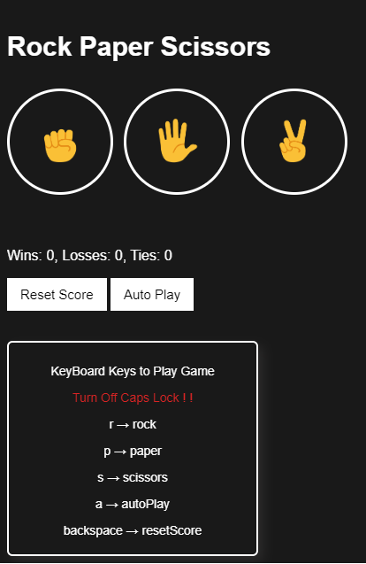

# Rock Paper Scissors Game

This is a simple Rock Paper Scissors game developed using HTML, CSS, and JavaScript. The game allows players to play the classic Rock Paper Scissors game against the computer. It includes features such as player input through keyboard keys, score tracking, autoplay mode, and score reset.

## Live Demo

You can play the game online by visiting the following link: [Play Rock Paper Scissors](https://anand5013.github.io/rock-paper-scissors-game/)

## Features

- Play Rock Paper Scissors against the computer by clicking on the respective image buttons.
- Use keyboard shortcuts for playing the game: 'r' for rock, 'p' for paper, 's' for scissors, and 'a' for autoplay mode.
- Monitor your game progress with a scoreboard that tracks wins, losses, and ties.
- Scores are stored in local storage, so you can continue playing even after refreshing the page.
- Autoplay mode lets the computer randomly select moves and play against itself until you stop it.
- Reset the scores to start fresh by pressing the 'backspace' key.

## Technologies Used

- HTML
- CSS
- JavaScript

## Usage

You can play the game online by visiting the following link: [Play Rock Paper Scissors](https://anand5013.github.io/rock-paper-scissors-game/)

Alternatively, if you want to explore the source code or run the game locally:

1. Clone the repository:

```bash
git clone https://github.com/anand5013/rock-paper-scissors-game.git
```

2. Open the `index.html` file in your web browser to play the game.

## Screenshots



## Author

Created by [ANAND B](https://github.com/Anand5013)
